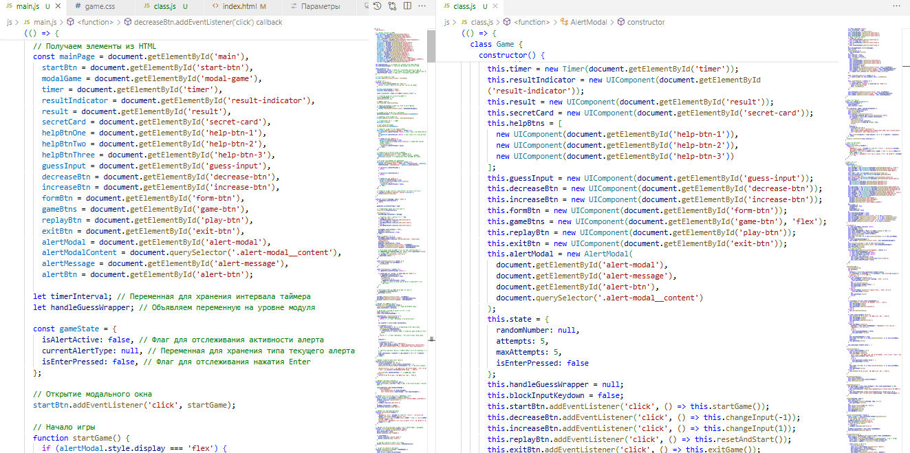

# OOP vs Procedural: My Refactoring Story

## Why I Decided to Refactor

After completing the "Classes" topic in JavaScript, I decided to practice by refactoring my [Guess Number Game](https://kate8382.github.io/guess_number_game/) from procedural code to an object-oriented approach. I thought it would be a quick and easy task... but I quickly realized it was much more challenging than expected!

## Main Challenges

**OOP is not just “wrapping everything in a class.”**

Simply replacing functions with methods and variables with properties wasn’t enough. I had to rethink the architecture, class responsibilities, and how components interact. This was a great learning experience!

**The biggest headache — handling Enter and alerts**

- **main.js (procedural style):**
  - *Problem:* Pressing Enter in the input while the alert modal was shown caused the alert to close instantly. The keydown (Enter) event "leaked" to the document handler and closed the alert.
  - *Solution:* Using setTimeout (100ms) and an isEnterPressed flag. The keydown handler was attached after a delay, so the Enter event was already "forgotten" by the browser. Simple and effective!

- **class.js (OOP style):**
  - *Problem:* When moving the logic to classes and trying to implement a clean architecture (AlertModal manages only itself, Game only the UI), the bug reappeared. Delays and flags no longer helped: the Enter event still bubbled up and closed the alert immediately.
  - *Why it didn’t work:* In the OOP structure, the alert was shown and the keydown handler attached synchronously, but the Enter event was already in the browser’s event queue. Delays, timeStamp, and flags couldn’t "cancel" it.
  - *Real solution:*
    - Moved the keydown handler from document to the alert-modal itself, so the Enter event from the input wasn’t caught globally.
    - Used setTimeout before focusing the alert-btn (OK), so the browser "forgot" about Enter and didn’t trigger a click on the OK button automatically.
  - *Conclusion:* Only the combination of: blur input → show alert → setTimeout → focus alert-btn → keydown handler on alert-modal guarantees the alert works correctly without Enter bugs.

## New Methods and Patterns

During this process, I learned about:
- Encapsulation (separate classes for UI components, modals, timer, and the game itself)
- Code reuse (show, hide, setText, addClass, removeClass)
- Careful event handler management
- And finally, I stopped being afraid of losing `this`!

## Key Takeaways

- In procedural main.js, a delay and flags were enough
- In OOP class.js, I had to dive deeper into the event loop, event bubbling, and browser quirks
- Now I understand JavaScript “under the hood” much better, and I can proudly say: “I can write class-based code!”

P.S. Without deep logging and analyzing the event sequence, this bug would have been impossible to catch! And honestly, without GitHub Copilot, I’d still be struggling. Sometimes you just need a patient mentor — even if it’s AI. 😅

If, like me, you’re just starting to explore OOP in JavaScript — don’t be afraid to experiment, make mistakes, and ask questions (even to Copilot). It really helps!

## Screenshot

Comparison of procedural and OOP approaches (main.js vs class.js):

