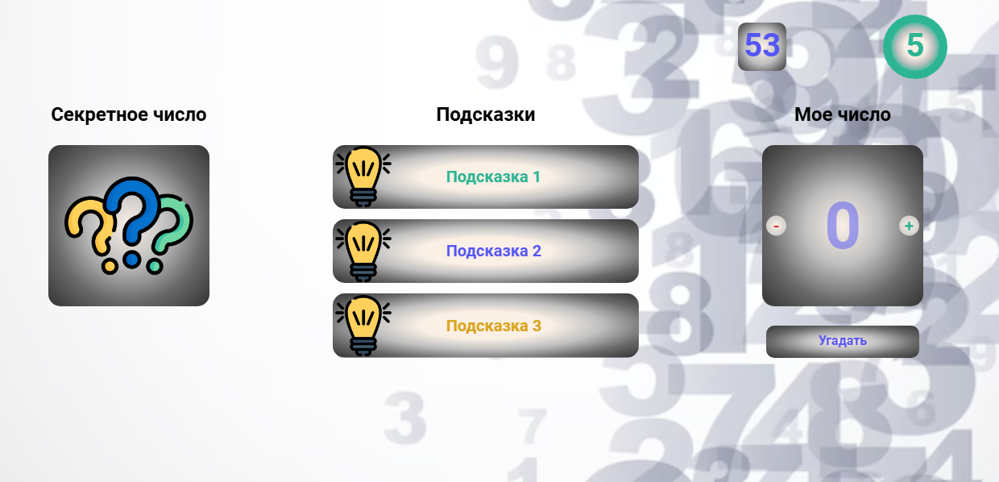
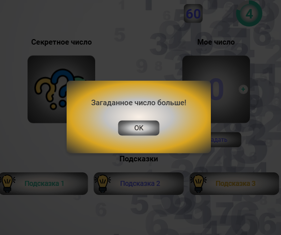
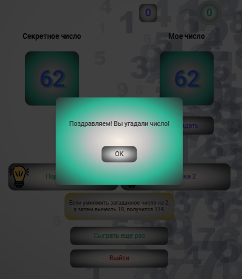
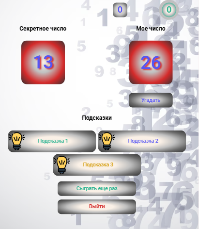

# Guess Number Game

## Description

This project is a practical assignment for self-study of the JavaScript "Advanced Level" course, focusing on a deeper understanding of the topics "Browser Events" and "Execution Context."

This is a simple game where the user needs to guess the number chosen by the computer. The project is developed using HTML, CSS, and JavaScript.

## Screenshots

### Desktop Version (1024px)


### Adaptive Design (768px) with Info Alert


### Victory Alert (560px)


### End of Game with Loss (560px)


## Access the Game

You can play the game online through GitHub Pages:

[Guess Number Game](https://kate8382.github.io/guess_number_game/)

## View the Code

You can view and clone the source code from the GitHub repository:

[View Source Code](https://github.com/kate8382/guess_number_game.git)

## Installation

1. Clone the repository:
   ```bash
   git clone https://github.com/yourusername/guess_number_game.git
   ```
2. Open the `index.html` file in your browser.

## Usage

- Follow the on-screen instructions to guess the number.
- Enjoy the game!

## License

This project is licensed under the MIT License. See the [LICENSE](./LICENSE) file for details.